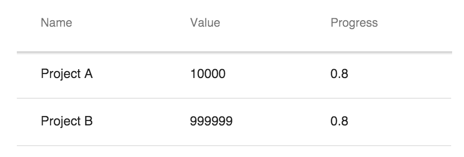

[[assigning.html.data]]
= Assigning HTML Data

Easiest way to assign data into `<vaadin-grid>` is to use a HTML table.

To get started, you can take any existing `<table>` element and place it inside the
`<vaadin-grid>` element.

Then, you need to define the number of columns displayed by inserting `<col>` elements inside the `<table>` element. You can wrap them inside
a `<colgroup>` element like done in the example below, but that's optional.

[source,html]
----
<vaadin-grid>
  <table>
    <colgroup>
      <col>
      <col>
      <col>
    </colgroup>
    <thead>
      <tr>
        <th>Name</th>
        <th>Value</th>
        <th>Progress</th>
      </tr>
    </thead>
    <tbody>
      <tr>
        <td>Project A</td>
        <td>10000</td>
        <td>0.8</td>
      </tr>
      <tr>
        <td>Project B</td>
        <td>999999</td>
        <td>0.8</td>
      </tr>
    </tbody>
  </table>
</vaadin-grid>
----

Learn more about <<configuring.columns, "configuring columns">>. +
Learn more about <<customizing.headers, "customizing headers and footers">>.

See link:https://cdn.vaadin.com/vaadin-elements/master/vaadin-grid/demo/datasources.html[live example].
