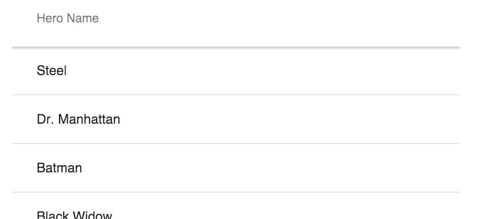

[[vaadin.grid.assigning.json.data.object]]
= Using Object Values

When using dynamic data, you can provide an array of objects to `<vaadin-grid>`.

image:img/assigning-json-data.png[]

First, you need to define which columns will be displayed. You can do this using the `<col>`
elements, like in the example below, or by using the javascript API, as described in <<vaadin.grid.configuring.columns, "Configuring Columns">>.

The `name` attribute defines which property from the data items are displayed in each column.

If you do not provide a `<thead>` element for the header, headers will be automatically generated
from the `name` attributes, as described in <<vaadin.grid.customizing.headers, "Customizing Headers and Footers">>.

[source,html]
----
<vaadin-grid>
  <table>
    <colgroup>
      <col name="projectName">
      <col name="cost.estimate">
    </colgroup>
  </table>
</vaadin-grid>
----

After you have configured the columns, you can assign the data.

[source,javascript]
----
grid.items = [ { projectName: "Project A", cost: {estimate: 10000, current: 8000 } },
             { projectName: "Project B", cost: {estimate: 20000, current: 11000 } },
             { projectName: "Project C", cost: {estimate: 15000, current: 1000 } } ];
----

Optionally, you can configure the columns in Javascript.

[source,javascript]
----
grid.columns[0].name = 'projectName';
grid.columns[1].name = 'cost.estimate';
----

ifdef::web[]
====
See link:https://cdn.vaadin.com/vaadin-elements/latest/vaadin-grid/demo/datasources.html[live example].
====
endif::web[]

[[vaadin.grid.assigning.json.data.primitive]]
= Using Primitive Values

When your data consist of primitive values, columns are mapped indexes instead of `name` property.

First, you need to define a column by a `<col>` element without
a `name` attribute, like in the example below, or by using the javascript API, as described in <<vaadin.grid.configuring.columns, "Configuring Columns">>.

Note that the header auto generation does not apply here, so you have to define a `<thead>` element also.

[source,html]
----
<vaadin-grid>
  <table>
    <colgroup>
      <col>
    </colgroup>
    <thead>
      <tr>
        <th>Hero Name</th>
      </tr>
    </thead>
  </table>
</vaadin-grid>
----

After you have configured the columns, you can assign the data.

[source,javascript]
----
grid.items = ['Steel', 'Dr. Manhattan', 'Batman', 'Black Widow', 'Rorschach', ...]
----

In case you need more columns than one, add another `<col>` and `<th>` elements and provide the data
using nested arrays.

[source, javascript]
----
grid.items = [['Steel', 'New York'], ['Dr. Manhattan', 'Chicago'], ['Batman', 'Gotham'], ...]
----

ifdef::web[]
====
See link:https://cdn.vaadin.com/vaadin-elements/master/vaadin-grid/demo/datasources.html[live example].
====
endif::web[]
