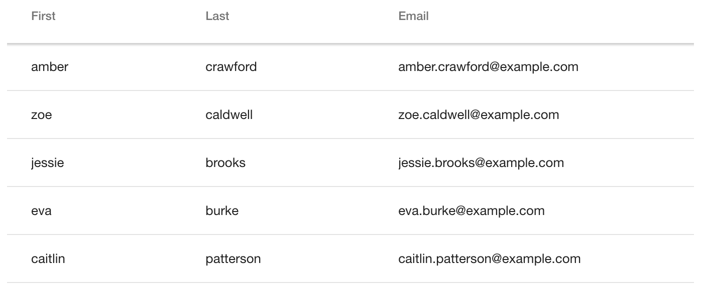

[[overview]]
= Overview

In this chapter, we'll show you how to get started with assigning data to your `<vaadin-grid>`.

We'll go through the basics of using HTML and JSON Objects to generate a grid that looks like the one below.

[[figure.overview]]
.A <vaadin-grid> displaying data with three columns.

For more advanced data assignment topics, see <<vaadin.grid.lazy.loading#overview, "Lazy Loading and Remote Data">>.

[[html]]
= Using Data from a HTML Table

Easiest way to assign data into `<vaadin-grid>` is to use a HTML table.

To get started, you can take any existing `<table>` element and place it inside the
`<vaadin-grid>` element.

Then, you need to define the number of columns displayed by inserting `<col>` elements inside the `<table>` element. You can wrap them inside
a `<colgroup>` element like done in the example below, but that's optional.

[source,html]
----
<vaadin-grid>
  <table>
    <colgroup>
      <col>
      <col>
    </colgroup>
    <thead>
      <tr>
        <th>First</th>
        <th>Last</th>
        <th>Email</th>
      </tr>
    </thead>
    <tbody>
      <tr>
        <td>amber</td>
        <td>crawford</td>
        <td>amber.crawford@example.com</td>
      </tr>
      <tr>
        <td>zoe</td>
        <td>caldwell</td>
        <td>zoe.caldwell@example.com</td>
      </tr>
      <tr>
        <td>jessie</td>
        <td>brooks</td>
        <td>jessie.brooks@example.com</td>
      </tr>
      <tr>
        ...
      </tr>
    </tbody>
  </table>
</vaadin-grid>
----

[[object]]
= Using Object Values

When using objects as data, you can provide the array of objects to `<vaadin-grid>`.

First, you need to define which columns will be displayed. +
You can do this using the `<col>`
elements, like in the example below.

[source,html]
----
<vaadin-grid>
  <table>
    <colgroup>
      <col name="user.name.first">
      <col name="user.name.last">
      <col name="user.email">
    </colgroup>
  </table>
</vaadin-grid>
----

Optionally, you can dismiss the whole `<table>` element configure the columns using the javascript API, as described in <<vaadin.grid.configuring.columns#overview, "Configuring Columns">>.

[source,javascript]
----
grid.columns = [ {name: 'user.name.first'},
                 {name: 'user.name.last'},
                 {name: 'user.email'} ];
----

The `name` attribute defines which property from the data items are displayed in each column.

If you do not provide a `<thead>` element for the header, headers will be automatically generated
from the `name` attributes, as described in <<vaadin.grid.customizing.headers#overview, "Customizing Headers and Footers">>.

After you have configured the columns, you can go ahead and assign the data array.

[source,javascript]
----
grid.items = [ { user: {
                  name: { first: 'amber', last: 'crawford' },
                  email: 'amber.crawford@example.com' },
                user: {
                  name: { first: 'zoe', last: 'caldwell' },
                  email: 'zoe.caldwell@example.com' },
                user: {
                  name: { first: 'jessie', last: 'brooks' },
                  email: 'jessie.brooks@example.com' },
                ...
              } ];
----

ifdef::web[]
====
See link:https://cdn.vaadin.com/vaadin-elements/latest/vaadin-grid/demo/datasources.html[live example].
====
endif::web[]

[[primitive]]
= Using Primitive Values

When your data consist of primitive values, columns are mapped indexes instead of `name` property.

First, you need to define a column by a `<col>` element without
a `name` attribute, like in the example below, or by using the javascript API, as described in <<vaadin.grid.configuring.columns#overview, "Configuring Columns">>.

Note: The header auto generation does not apply here because we're missing the `name` property, so you *have* to define a `<thead>` element also.

[source,html]
----
<vaadin-grid>
  <table>
    <colgroup>
      <col>
    </colgroup>
    <thead>
      <tr>
        <th>First Name</th>
      </tr>
    </thead>
  </table>
</vaadin-grid>
----

After you have configured the columns, you can go ahead and assign the data.

[source,javascript]
----
grid.items = ['amber', 'zoe', 'jessie', 'eva', ...]
----

In case you need more columns than one, add another `<col>` and `<th>` elements and provide the data
using nested arrays.

[source,javascript]
----
grid.items = [['amber', 'crawford'], ['zoe', 'caldwell'], ['jessie', 'brooks'], ...]
----

ifdef::web[]
====
See link:https://cdn.vaadin.com/vaadin-elements/master/vaadin-grid/demo/datasources.html[live example].
====
endif::web[]

[[dynamic]]
= Using Dynamic Data

When using data that changes dynamically, `<vaadin-grid>` must be notified by the changes.

* `size` property is used to tell `<vaadin-grid>` the size of the active dataset. +
If you add or remove items, you need to update the size accordingly. +
Like any other property, `size` can also be applied as an attribute: `<vaadin-grid size="100">``

Note: When using arrays as data, the `length` of the original item array is set as the initial `size`.

[source,javascript]
----
// in this case, grid.items.push(...); would do the same, but using grid.push('items', ...); is preferred.
grid.push('items', { user: { name: { first: 'eva', last: 'burke' }, email: 'eva.burke@example.com' } };

// increase the size after pushing a new item.
grid.size++;
----

* `refreshItems()` function is used to tell `<vaadin-grid>` to refresh the displayed data. +
If the contents of the data changes, you need to call `refreshItems()`.

[source,javascript]
----
grid.items[0].email = 'amber.crawford@example.co.uk';
grid.refreshItems();
----

ifdef::web[]
====
See link:https://cdn.vaadin.com/vaadin-elements/master/vaadin-grid/demo/datasources.html[live example].
====
endif::web[]
