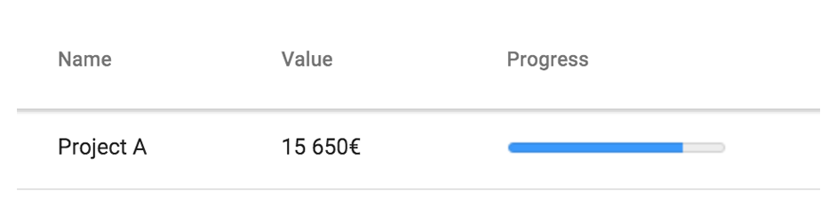

[[vaadin-grid.formatting]]
= Data Formatting

In the <<vaadin.grid.assigning.data, "Assigning Data">> chapter we learned how to assign data items to be displayed as the rows of the Grid.
Often the provided items might have data in a different format that is suitable for displaying in the user interface.
This chapter explains how to do formatting on your data before being displayed in the Grid.

== Inline Data

If you are providing the items using as an HTML `table` using the DOM directly, you can add any HTML elements into Grid cells.
In the example below, you can see how a `progress` element is used within the provided data.

[source,html]
----
<vaadin-grid>
  <table>
    [...]
      <tr>
        <td>Project A</td>
        <td>15 650€</td>
        <td><progress value="0.8"></progress></td>
      </tr>
  </table>
</vaadin-grid>
----

[[figure.vaadin-grid.formatting.inline]]
.Adding HTML elements into Grid cell.

== Using Data Renderers

When providing data as an array of items or as a datasource function, you need to use a renderer function to format the data.
Each Grid column can be given a function as their `renderer` property.

A renderer function will get a reference to the `cell` being rendered as an argument.
This reference can be used to manipulate its `innerHTML` property or for example use standard DOM API to append a child element.

In order to re-create the usage of `progress` element in the previous section, we can write a following renderer function.

[source,javascript]
----
var progressRenderer = function(cell) {
  cell.element.innerHTML = '';

  var progressElement = document.createElement('progress');
  progressElement.setAttribute('value', cell.data);
  cell.element.appendChild(progressElement);
};
----

After we have defined the function, we still need to hook it into a column of the Grid.
You can do this by using the `grid.columns` array as follows.

[source,javascript]
----
grid.columns[2].renderer = progressRenderer;
----
