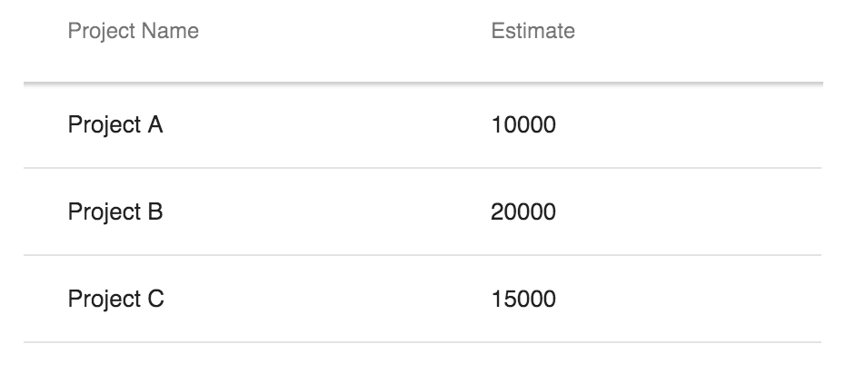

[[headers]]
= Customizing headers and footers

`<vaadin-grid>` has a header section above and a footer section below the scrollable data area (compares to `thead` and `tfoot` sections of an html `table` element).

Typically you would use the header section to place a title above an individual column to describe the data on its data rows.

Configuring content for a single cell is the most trivial case.
For further customization `<vaadin-grid>` provides APIs for modifying column spans and row count similarly for both of the sections.

== Cell content

To assign titles to `<vaadin-grid>` columns like in the example above you can declare them inline in the `thead` section cells of your `table` configurator element.
[source,html]
----
<vaadin-grid>
  <table>
    <colgroup>
      <col>
      <col>
    </colgroup>
    <thead>
      <tr>
        <th>
          Project Name
        </th>
        <th>
          Estimate
        </th>
      </tr>
    </thead>
  </table>
</vaadin-grid>
----

This results in a `<vaadin-grid>` with 'Project name' as the title for the first column and 'Estimate' for the second.

Note: If header cells aren't applied any content explicitly, they fallback to using a prettified projection of the column's `name` property.

What can be placed inside header and footer isn't limited to text only.
You may define the cell content in plain HTML to add elements and style tweaks for the content.
The following example adds HTML (an image and some bolded text) in `<vaadin-grid>` footer.

[source,html]
----
<vaadin-grid>
  <table>
    <colgroup>
      <col>
      <col>
    </colgroup>
    <tfoot>
      <tr>
        <td>
          
        </td>
        <td>
          <b>Bold text</b>
        </td>
      </tr>
    </tfoot>
  </table>
</vaadin-grid>
----

=== Cell and content API

`<vaadin-grid>` exposes JavaScript APIs for programmatically changing the content of a cell in the header (and footer respectively).

First thing you'll need is access to the `cell` whose content is to be changed.
`<vaadin-grid>` has properties `header` and `footer` (JavaScript objects) for accessing the dedicated APIs under the sections.
Attaining access to a specific cell happens via `getCell(rowIndex, columnIndex)` function on those very objects.

From there on changing the content is a matter of modifying the cell's `content` property.
Similarly to the declarative version, the imperative API accepts plain text, HTML or an element to be displayed inside the cell.

[source,javascript]
----
// Text placed in the first cell of the first row in the grid header
grid.header.getCell(0, 0).content = 'Project Name';
// HTML placed in the first cell of the first row in the grid footer
grid.footer.getCell(0, 0).content = '<b>Bold text</b>'
// A pre-defined element placed in the second cell of the first row in the grid header
grid.header.getCell(0, 1).content = this.$.filterTextField;
----

== Column span

Each cell in the header/footer has the same width as the column's data cells by default.
By adjusting a cell's `colspan` property it can be extended to span over more than just one column.

The following example adds some HTML content inside the `<vaadin-grid>` footer and spans it over 2 columns.

[source,html]
----
<vaadin-grid>
  <table>
    <colgroup>
      <col>
      <col>
    </colgroup>
    <thead>
      <tr>
        <th>First Name</th>
        <th>Last Name</th>
      </tr>
    </thead>
    <tfoot>
      <tr>
        <th colspan="2">Number of selected rows:
          0
        </th>
      </tr>
    </tfoot>
  </table>
</vaadin-grid>
----

Colspan can be adjusted in JavaScript also by changing a cell's `colspan` property.

[source,javascript]
----
grid.footer.getCell(0, 0).colspan = 2;
----

== Row count

image:img/vaadin-grid-headers-row-count.png[]

By default there's one row in the `<vaadin-grid>` header and no rows in the footer.
You can add new `<tr>` elements to your declarative `table` configurator on each sections to affect the number of visible rows.

The header and footer in the image above is achieved with the following:

[source,html]
----
<vaadin-grid>
  <table>
    <colgroup>
      <col>
      <col>
      <col>
      <col>
    </colgroup>
    <thead>
      <tr>
        <th colspan="2">Name</th>
        <th colspan="2">Location</th>
      </tr>
      <tr>
        <th>First</th>
        <th>Last</th>
        <th>Street</th>
        <th>City</th>
      </tr>
    </thead>
    <tfoot>
      <tr>
        <th colspan="4">Number of selected rows:
          0
        </th>
      </tr>
    </tfoot>
  </table>
</vaadin-grid>
----

=== Header/footer APIs

In addition to `getCell(rowIndex, columnIndex)` mentioned earlier header/footer exposes other, mostly row related APIs.

New rows can be added with `addRow(rowIndex, cellContent)` and existing ones removed with `removeRow(rowIndex)`.
The parameter `rowIndex` is quite self explanatory in both cases; a zero-based index of the targeted row.

The second parameter `cellContent` in the formerly mentioned function is an optional array which allows you to easily specify content for the cells on the new row.

[source,javascript]
----
// Adding a new row to the grid header with predefined cell content
grid.header.addRow(1, ['First Name', document.createElement('input'), '<b>Score</b>']);
----

There's also a handful of related properties in a header/footer object.
TODO:
rowCount
defaultRow
hidden
