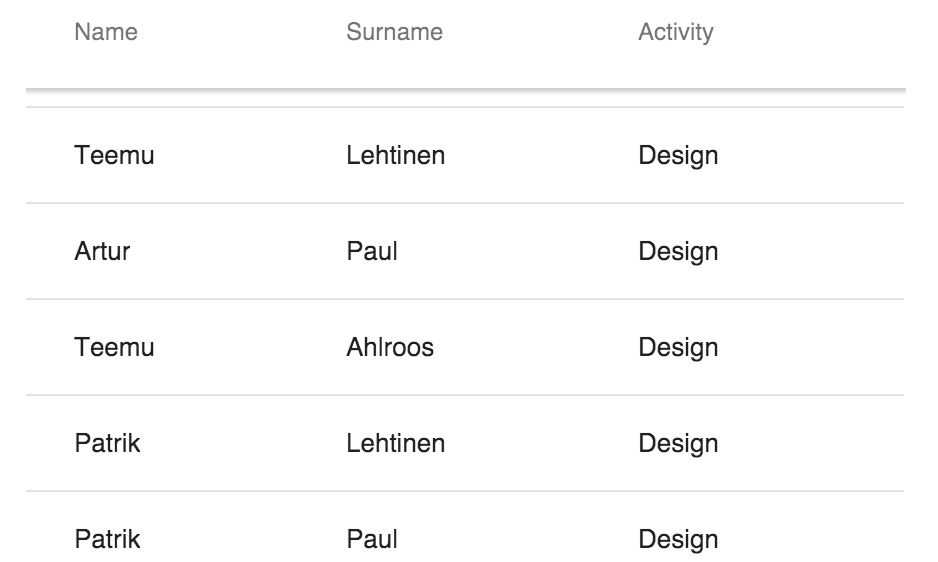

[[overview]]
= Overview

In this chapter, you'll learn how to use functions as data sources. That enables you to use
lazy loading and remote data, like REST APIs.

[[functions]]
= Function Data Source

In addition to assigning an array to the `items` property, you can alternatively assign a function. +
`<vaadin-grid>` will call this function lazily, only when it needs more data to be displayed.

`params` argument provides `index` and `count` properties, telling the starting index from which
data should be returned, and how many items should be returned, respectively.

`callback` argument is a callback function which takes an array of the requested items as a parameter.

[source,javascript]
----
var employees = [ { name: 'Teemu', surname: 'Lehtinen', activity: 'Design' },
                  { name: 'Artur', surname: 'Paul', activity: 'Design' },
                  { name: 'Teemu', surname: 'Ahlroos', activity: 'Design' },
                  ... ];

grid.size = employees.length;
grid.items = function(params, callback) {
  callback(employees.slice(params.index, params.index + params.count));
};
----

When using function data sources, `size` needs always to be set manually. +
You can set it once, like done in the example above, or alternatively as a parameter given to the `callback` function.

[source,javascript]
----
callback(employees.slice(params.index, params.index + params.count), employees.length);
----

For more details, see the API Documentation https://cdn.vaadin.com/vaadin-core-elements/latest/vaadin-grid/

ifdef::web[]
====
See link:https://cdn.vaadin.com/vaadin-elements/master/vaadin-grid/demo/datasources.html[live example].
====
endif::web[]

[[remote]]
= Remote Data

Using remote data does not differ much from using arrays within a function data source.
You just need make sure you're handing over an array of data to the `callback` function.

The `index` and `count` properties from the `params` argument come in handy if you're using a
REST API which supports fetching partial result sets.

[source,javascript]
----
grid.items = function(params, callback) {
  var url = 'https://my.data/data?index=' + params.index + '&count=' + params.count;
  var xhr = new XMLHttpRequest();
  xhr.onreadystatechange = function() {
    if (xhr.readyState === XMLHttpRequest.DONE && xhr.status === 200) {
      var response = JSON.parse(xhr.responseText);
      callback(response.employees);
    }
  };

  xhr.open('GET', url, true);
  xhr.send();
};
----

Now, in most cases using remote data, you can't know the dataset size in advance.
Below are a few examples how you could set the `size` in different scenarios.

* There is a separate API for fetching the size:

[source,javascript]
----
// Define a function that you call manually every time you believe the size might've changed.
function setSize() {
  var url = 'https://my.data/size';
  var xhr = new XMLHttpRequest();
    xhr.onreadystatechange = function() {
      if (xhr.readyState === XMLHttpRequest.DONE && xhr.status === 200) {
        grid.size = JSON.parse(xhr.responseText).totalSize);
      }
    };
    xhr.open('GET', url, true);
    xhr.send();
  };
}
----

* The size is delivered with the data payload:

[source,javascript]
----
grid.items = function(params, callback) {
  var url = 'https://my.data/data?index=' + params.index + '&count=' + params.count;
  var xhr = new XMLHttpRequest();
  xhr.onreadystatechange = function() {
    if (xhr.readyState === XMLHttpRequest.DONE && xhr.status === 200) {
      var response = JSON.parse(xhr.responseText);

      callback(response.employees);
      // Assign size from the data payload.
      grid.size = response.totalSize;
    }
  };

  xhr.open('GET', url, true);
  xhr.send();
};
----

* There is no API for getting the total size at all:

[source,javascript]
----
// Set an initial size;
grid.size = 10;

grid.items = function(params, callback) {
  var url = 'https://my.data/data?index=' + params.index + '&count=' + params.count;
  var xhr = new XMLHttpRequest();
  xhr.onreadystatechange = function() {
    if (xhr.readyState === XMLHttpRequest.DONE && xhr.status === 200) {
      var response = JSON.parse(xhr.responseText);

      callback(response.employees);
      // Increase the size dynamically, resulting in "infinite" scrolling.
      if (params.index + params.count == grid.size) {
        grid.size += 10;
      }
    }
  };

  xhr.open('GET', url, true);
  xhr.send();
};
----

ifdef::web[]
====
See link:https://cdn.vaadin.com/vaadin-elements/master/vaadin-grid/demo/datasources.html[live example].
====
endif::web[]
