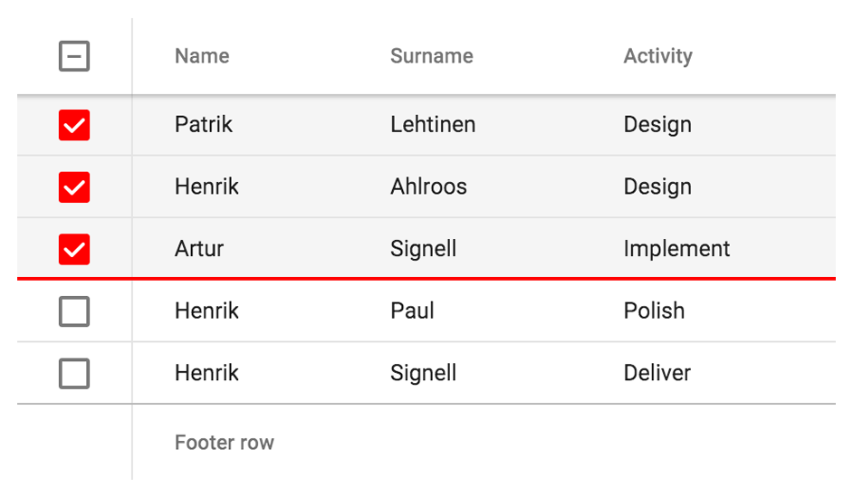

[[vaadin-grid.styling]]
= Styling

The appearance of Vaadin Grid is designed to fit in with the https://www.google.com/design/spec/material-design/[Material Design] language from Google.
This chapter will explain how you can customize the look of your Vaadin Grid to fit your own application theme.
Some CSS properties like `font-family` will be inherited from the containing page while others may need to be changed with custom CSS properties.

== Sizing

By default the Vaadin Grid takes all horizontal space available and set its height depending on the number of data rows.
You can change this behavior by using standard CSS properties like `width` and `height`.

The height can also be defined as the number of rows to be displayed by using the `visible-rows` attribute or `grid.visibleRows` JavaScript property.

== Custom Properties
Vaadin Grid is compatible with the https://github.com/PolymerElements/paper-styles[paper-styles] from the https://elements.polymer-project.org/[Polymer Element Catalog].
The selection checkboxes and focus highlights inherit their color from the `--default-primary-color` defined in the `paper-styles`.

You can also use some custom properties defined by the Grid.
Currently these only cover changing the row heights on the data rows, headers and footers.

.Available custom properties
|===
|Custom property |Description	|Default value
|`--vaadin-grid-row-height`
|Data row height
|48px

|`--vaadin-grid-header-row-height`
|Header row height
|56px

|`--vaadin-grid-footer-row-height`
|Footer row height
|56px
|===

[[figure.vaadin-grid.styling.example]]
.An example of custom highlight color and row heights.

